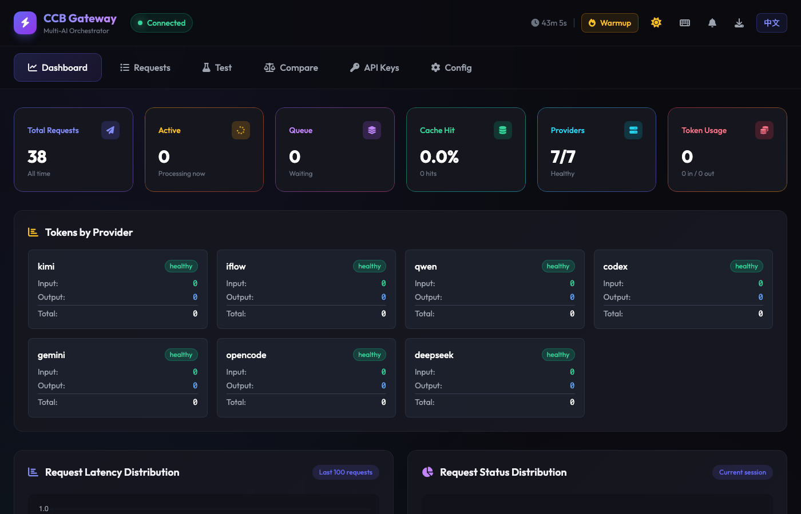
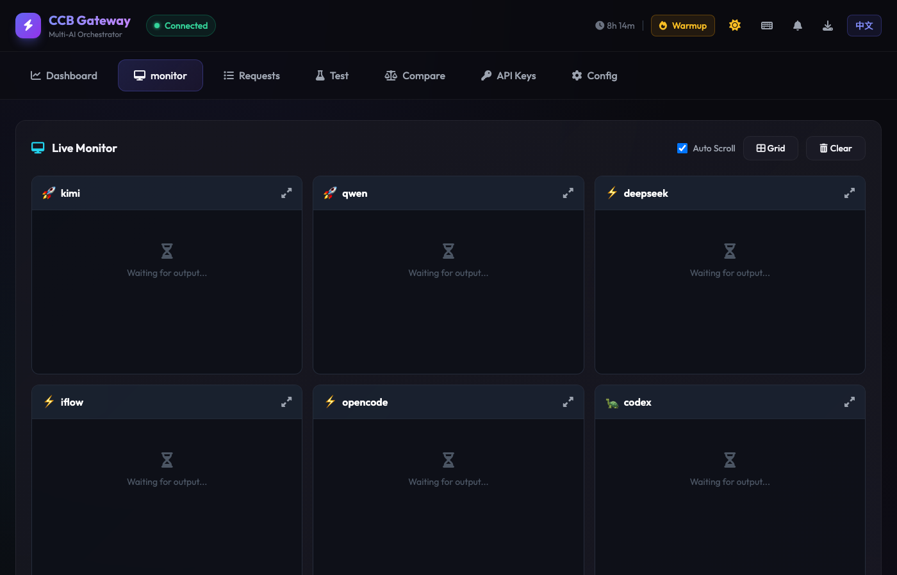

<p align="center">
  
  
  
  
</p>

<h1 align="center">
  <br>
  🤖
  <br>
  CCB Gateway
  <br>
</h1>

<h4 align="center">Enterprise-Grade Multi-AI Orchestration Platform</h4>

<p align="center">
  <em>Claude as orchestrator, unified Gateway API managing 8 AI providers with real-time monitoring and model switching</em>
</p>

<p align="center">
  <a href="#-features">Features</a> •
  <a href="#-quick-start">Quick Start</a> •
  <a href="#-ccb-cli">ccb-cli</a> •
  <a href="#-multi-ai-discussion">Discussion</a> •
  <a href="#-web-ui">Web UI</a> •
  <a href="#-api-reference">API</a>
</p>

<p align="center">
  <strong>English</strong> | <a href="README.zh-CN.md">简体中文</a>
</p>

<p align="center">
  
</p>

---

## Overview

**CCB Gateway** is a production-ready multi-AI orchestration platform where **Claude serves as the orchestrator**, intelligently dispatching tasks to 8 AI providers through a unified Gateway API.

```
                    ┌─────────────────────────────┐
                    │   Claude (Orchestrator)     │
                    │      Claude Code CLI        │
                    └─────────────┬───────────────┘
                                  │
              ┌───────────────────┼───────────────────┐
              │                   │                   │
    ┌─────────▼─────────┐ ┌──────▼──────┐ ┌─────────▼─────────┐
    │   ccb-cli (NEW)   │ │ Gateway API │ │   ccb-submit      │
    │  Direct CLI call  │ │  REST/WS    │ │   Async Queue     │
    └─────────┬─────────┘ └──────┬──────┘ └─────────┬─────────┘
              │                  │                   │
              └──────────────────┼───────────────────┘
                                 │
          ┌───────────┬──────────┼──────────┬───────────┬───────────┐
          ▼           ▼          ▼          ▼           ▼           ▼
     ┌─────────┐ ┌─────────┐ ┌─────────┐ ┌─────────┐ ┌─────────┐ ┌─────────┐
     │  Kimi   │ │  Qwen   │ │DeepSeek │ │  Qoder  │ │  Codex  │ │ Gemini  │
     │  🚀 7s  │ │  🚀 12s │ │  ⚡ 16s │ │  ⚡ 30s │ │ 🐢 48s  │ │ 🐢 71s  │
     └─────────┘ └─────────┘ └─────────┘ └─────────┘ └─────────┘ └─────────┘
                      ┌─────────┐ ┌─────────┐
                      │  iFlow  │ │OpenCode │
                      │  ⚡ 25s │ │  ⚡ 42s │
                      └─────────┘ └─────────┘
```

### Why CCB Gateway?

| Challenge | Solution |
|-----------|----------|
| Multiple AI CLIs with different interfaces | **Unified Gateway API** + **ccb-cli** for all providers |
| Manual provider selection | **Intelligent routing** with speed-tiered fallback |
| No model switching within providers | **Dynamic model selection** (o3, gpt-4o, gemini-3-flash, etc.) |
| No visibility into AI operations | **Real-time monitoring** with WebSocket + Web UI |
| No caching or retry logic | **Built-in caching, retry, and fallback chains** |
| Can't see AI thinking process | **Thinking chain & raw output capture** |
| No collaborative AI discussion | **Multi-AI Discussion** with iterative rounds |

---

## ✨ Features

### 🆕 Gateway Auto-Start (v0.13)

Gateway starts automatically when you use ccb-cli - no manual startup needed:

```bash
# First call auto-starts Gateway
ccb-cli kimi "Hello"
# ⚡ Gateway not running, starting...
# ✓ Gateway started (PID: 12345)
# Response from Kimi...

# macOS: Auto-start on boot with launchd
cp config/com.ccb.gateway.plist ~/Library/LaunchAgents/
launchctl load ~/Library/LaunchAgents/com.ccb.gateway.plist
```

### 🆕 ccb-cli (v0.11)

Direct CLI tool with model selection - routes through Gateway:

```bash
ccb-cli <provider> [model] <prompt>
```

| Provider | Models | Example |
|----------|--------|---------|
| **Codex** | o3, o4-mini, o1-pro, gpt-4o, gpt-5.2-codex | `ccb-cli codex o3 "complex algorithm"` |
| **Gemini** | 3f, 3p, 2.5f, 2.5p | `ccb-cli gemini 3f "React component"` |
| **OpenCode** | mm, kimi, ds, glm | `ccb-cli opencode mm "general task"` |
| **DeepSeek** | reasoner, chat | `ccb-cli deepseek chat "quick question"` |
| **Kimi** | thinking, normal | `ccb-cli kimi thinking "detailed analysis"` |
| **iFlow** | thinking, normal | `ccb-cli iflow "workflow task"` |
| **Qwen** | - | `ccb-cli qwen "code generation"` |
| **Qoder** | - | `ccb-cli qoder "Review this code"` |

### 🆕 Multi-AI Discussion (v0.12)

Orchestrate collaborative discussions across multiple AI providers:

```bash
# Start a discussion
ccb-discussion "Design a distributed cache system"

# With specific providers
ccb-discussion -p kimi,qwen,deepseek "API design best practices"

# Quick mode (2 rounds)
ccb-discussion --quick "Code review approach"

# Wait for completion
ccb-discussion -w "Architecture decision"
```

**Discussion Flow:**
```
Round 1: Proposal    →   Round 2: Review    →   Round 3: Revision
┌─────────────┐         ┌─────────────┐         ┌─────────────┐
│ All AIs     │   ───►  │ All AIs see │   ───►  │ Revise based│
│ propose     │         │ & review    │         │ on feedback │
└─────────────┘         └─────────────┘         └─────────────┘
                              │
                              ▼
                    ┌─────────────────┐
                    │ Claude Summary  │
                    │ Consensus/Gaps  │
                    └─────────────────┘
```

### Core Gateway

- **REST API** - `POST /api/ask`, `GET /api/reply/{id}`, `GET /api/status`
- **WebSocket** - Real-time events at `/api/ws`
- **Priority Queue** - SQLite-backed request prioritization
- **Multi-Backend** - HTTP API, CLI Exec, WezTerm integration
- **Health Monitoring** - Automatic provider health checks

### Production Features

- **API Authentication** - API key-based auth with SHA-256 hashing
- **Rate Limiting** - Token bucket algorithm, per-key limits
- **Response Caching** - SQLite cache with TTL and pattern exclusion
- **Retry & Fallback** - Exponential backoff, automatic provider fallback
- **Smart Fallback** - Reliability-based provider selection
- **Parallel Queries** - Query multiple providers simultaneously
- **Multi-AI Discussion** - Iterative collaborative discussions
- **Discussion Templates** - Pre-built templates for common scenarios
- **Discussion Export** - Export to Markdown, JSON, HTML, or Obsidian
- **Unified Results API** - Query all AI responses uniformly
- **Cost Tracking** - Token usage and cost monitoring per provider
- **Smart Routing** - Keyword-based automatic provider selection
- **Auth Status Monitoring** - Track provider authentication state
- **macOS Notifications** - System alerts for long operations
- **Shell Completion** - Bash/Zsh auto-completion for ccb-cli
- **Prometheus Metrics** - `/metrics` endpoint for monitoring
- **Streaming** - Server-Sent Events for real-time responses

### Provider Speed Tiers

| Tier | Providers | Response Time | Best For |
|------|-----------|---------------|----------|
| 🚀 **Fast** | Kimi, Qwen | 5-15s | Quick tasks, simple questions |
| ⚡ **Medium** | DeepSeek, iFlow, OpenCode | 15-60s | Complex reasoning, coding |
| 🐢 **Slow** | Codex, Gemini | 60-120s | Deep analysis, reviews |

---

## 🚀 Quick Start

### Method 1: ccb-cli (Recommended)

Gateway auto-starts - just run commands directly:

```bash
# Install (already included in ccb-dual)
# Scripts at ~/.ccb_config/scripts/ccb-cli

# Quick Chinese Q&A (Gateway auto-starts if needed)
ccb-cli kimi "什么是递归"

# Complex algorithm with o3
ccb-cli codex o3 "Design LRU cache algorithm"

# Frontend with Gemini 3 Flash
ccb-cli gemini 3f "React login component"

# Fast response
ccb-cli deepseek chat "HTTP status 200 means?"

# Detailed reasoning
ccb-cli kimi thinking "Analyze this problem step by step"
```

### Method 2: Gateway API

Full-featured async API with caching, retry, and monitoring:

```bash
# Gateway auto-starts with ccb-cli, or start manually:
cd ~/.local/share/codex-dual
python3 -m lib.gateway.gateway_server --port 8765

# Or install as launchd service (macOS auto-start on boot):
cp config/com.ccb.gateway.plist ~/Library/LaunchAgents/
launchctl load ~/Library/LaunchAgents/com.ccb.gateway.plist

# Submit request
curl -X POST http://localhost:8765/api/ask \
  -H "Content-Type: application/json" \
  -d '{"provider": "kimi", "message": "Hello"}'

# Get response
curl "http://localhost:8765/api/reply/{request_id}"
```

### Method 3: ccb-submit (Async)

```bash
# Async submission with polling
REQUEST_ID=$(ccb-submit kimi "Hello")
ccb-query get $REQUEST_ID
```

---

## 🛠️ ccb-cli

### Installation

```bash
# Already installed at
~/.ccb_config/scripts/ccb-cli

# Add to PATH (if not already)
export PATH="$HOME/.ccb_config/scripts:$PATH"
```

### Model Quick Reference

```bash
# Codex models (OpenAI)
ccb-cli codex o3 "..."        # Best reasoning
ccb-cli codex o4-mini "..."   # Fast
ccb-cli codex gpt-4o "..."    # Multimodal
ccb-cli codex o1-pro "..."    # Pro reasoning

# Gemini models
ccb-cli gemini 3f "..."       # Gemini 3 Flash (fast)
ccb-cli gemini 3p "..."       # Gemini 3 Pro (powerful)
ccb-cli gemini 2.5f "..."     # Gemini 2.5 Flash
ccb-cli gemini 2.5p "..."     # Gemini 2.5 Pro

# OpenCode models
ccb-cli opencode mm "..."     # MiniMax M2.1
ccb-cli opencode kimi "..."   # Kimi via OpenCode
ccb-cli opencode ds "..."     # DeepSeek Reasoner

# DeepSeek modes
ccb-cli deepseek reasoner "..." # Deep reasoning
ccb-cli deepseek chat "..."     # Fast chat

# Thinking mode (Kimi/iFlow)
ccb-cli kimi thinking "..."     # Show reasoning chain
ccb-cli iflow thinking "..."    # GLM with thinking
```

### Task → Model Selection

| Task Type | Recommended Command |
|-----------|---------------------|
| Complex Algorithm | `ccb-cli codex o3 "..."` |
| Quick Code | `ccb-cli codex o4-mini "..."` |
| Frontend Dev | `ccb-cli gemini 3f "..."` |
| Deep Analysis | `ccb-cli gemini 3p "..."` |
| Chinese Q&A | `ccb-cli kimi "..."` |
| Detailed Reasoning | `ccb-cli kimi thinking "..."` |
| Fast Dialog | `ccb-cli deepseek chat "..."` |
| Image Analysis | `ccb-cli codex gpt-4o "..."` |

---

## 🗣️ Multi-AI Discussion

### Overview

The discussion feature enables true multi-AI collaboration where all providers can see and respond to each other's perspectives through iterative rounds.

### CLI Usage

```bash
# Basic discussion
ccb-discussion "Design a microservices architecture"

# Specify providers
ccb-discussion -p kimi,qwen,deepseek "Best caching strategy"

# Quick mode (2 rounds, faster timeouts)
ccb-discussion --quick "Code review guidelines"

# Wait for completion and show results
ccb-discussion -w "API versioning approach"

# Check status of existing discussion
ccb-discussion -s <session_id>

# List recent discussions
ccb-discussion -l

# Export discussion to markdown
ccb-discussion -e <session_id> -f md > discussion.md

# Export to HTML file
ccb-discussion -e <session_id> -f html -o report.html
```

### Discussion Templates

Built-in templates for common scenarios:

| Template | ID | Description |
|----------|-----|-------------|
| Architecture Review | `arch-review` | Review system architecture decisions |
| Code Review | `code-review` | Collaborative code review |
| API Design | `api-design` | Design API endpoints and contracts |
| Bug Analysis | `bug-analysis` | Diagnose and analyze bugs |
| Performance Optimization | `perf-optimization` | Plan performance improvements |

```bash
# Use template via API
curl -X POST http://localhost:8765/api/discussion/templates/arch-review/use \
  -H "Content-Type: application/json" \
  -d '{
    "variables": {
      "subject": "Payment Service",
      "context": "Microservice handling Stripe integration"
    }
  }'
```

### Continue Discussion

Continue a completed discussion with follow-up questions:

```bash
curl -X POST http://localhost:8765/api/discussion/{session_id}/continue \
  -H "Content-Type: application/json" \
  -d '{
    "follow_up_topic": "Focus on security implications",
    "additional_context": "Particularly concerned about JWT handling",
    "max_rounds": 2
  }'
```

### Export & Integration

```bash
# Export to Markdown
curl "http://localhost:8765/api/discussion/{id}/export?format=md"

# Export to JSON (full data)
curl "http://localhost:8765/api/discussion/{id}/export?format=json"

# Export to HTML (styled document)
curl "http://localhost:8765/api/discussion/{id}/export?format=html"

# Export to Obsidian vault
curl -X POST http://localhost:8765/api/discussion/{id}/export-obsidian \
  -d '{"vault_path": "~/Obsidian/MyVault", "folder": "AI Discussions"}'
```

### API Usage

```bash
# Start discussion via API
curl -X POST http://localhost:8765/api/discussion/start \
  -H "Content-Type: application/json" \
  -d '{"topic": "Design distributed cache", "provider_group": "@coding"}'

# Get discussion status
curl http://localhost:8765/api/discussion/{session_id}

# Get all messages from discussion
curl http://localhost:8765/api/discussion/{session_id}/messages

# List all discussions
curl http://localhost:8765/api/discussions

# Get unified results (requests + discussions)
curl http://localhost:8765/api/results
```

### Discussion Rounds

| Round | Type | Description |
|-------|------|-------------|
| 1 | **Proposal** | Each AI provides initial analysis/solution |
| 2 | **Review** | Each AI reviews others' proposals, gives feedback |
| 3 | **Revision** | Each AI revises based on feedback received |
| Final | **Summary** | Orchestrator synthesizes consensus and gaps |

### Provider Groups

```bash
# All available providers
ccb-discussion -g @all "topic"

# Fast providers only (Kimi, Qwen)
ccb-discussion -g @fast "topic"

# Coding-focused (Kimi, Qwen, DeepSeek, Codex, Gemini)
ccb-discussion -g @coding "topic"
```

---

## 🖥️ Web UI

Access at `http://localhost:8765/` after starting Gateway.

<p align="center">
  
  <br>
  <em>Dashboard - Real-time gateway stats and provider status</em>
</p>

### Tabs

| Tab | Shortcut | Description |
|-----|----------|-------------|
| **Dashboard** | `1` | Gateway stats, provider status, activity logs |
| **Monitor** | `2` | Real-time AI output streaming (Grid/Focus view) |
| **Discussions** | `3` | Multi-AI discussion monitoring and management |
| **Requests** | `4` | Request history with search and filters |
| **Test** | `5` | Interactive API testing console |
| **Compare** | `6` | Side-by-side provider comparison |
| **API Keys** | `7` | API key management |
| **Config** | `8` | Gateway configuration viewer |

<p align="center">
  
  <br>
  <em>Discussions - Monitor multi-AI collaborative discussions in real-time</em>
</p>

<p align="center">
  
  <br>
  <em>Monitor - Watch AI responses stream in real-time</em>
</p>

### Features

- **Dark/Light Theme** - Toggle with `D` key
- **i18n Support** - English and Chinese
- **Keyboard Shortcuts** - `1-8` tabs, `R` refresh, `?` help
- **Real-time Updates** - WebSocket-powered live data

---

## 📡 API Reference

### Core Endpoints

| Method | Endpoint | Description |
|--------|----------|-------------|
| `POST` | `/api/ask` | Submit request |
| `GET` | `/api/reply/{id}` | Get response |
| `GET` | `/api/status` | Gateway status |
| `GET` | `/api/requests` | List requests |
| `GET` | `/api/results` | Unified results query |
| `GET` | `/metrics` | Prometheus metrics |

### Discussion Endpoints

| Method | Endpoint | Description |
|--------|----------|-------------|
| `POST` | `/api/discussion/start` | Start multi-AI discussion |
| `GET` | `/api/discussion/{id}` | Get discussion status |
| `GET` | `/api/discussion/{id}/messages` | Get discussion messages |
| `GET` | `/api/discussion/{id}/export` | Export discussion (md/json/html) |
| `POST` | `/api/discussion/{id}/continue` | Continue completed discussion |
| `POST` | `/api/discussion/{id}/export-obsidian` | Export to Obsidian vault |

### Template Endpoints

| Method | Endpoint | Description |
|--------|----------|-------------|
| `GET` | `/api/discussion/templates` | List all templates |
| `POST` | `/api/discussion/templates` | Create custom template |
| `GET` | `/api/discussion/templates/{id}` | Get template details |
| `POST` | `/api/discussion/templates/{id}/use` | Start discussion from template |

### Operations Endpoints

| Method | Endpoint | Description |
|--------|----------|-------------|
| `GET` | `/api/providers/{name}/auth-status` | Check provider auth status |
| `POST` | `/api/providers/{name}/check-auth` | Actively verify auth |
| `GET` | `/api/providers/reliability` | Get all reliability scores |
| `GET` | `/api/costs/summary` | Cost summary (today/week/month) |
| `GET` | `/api/costs/by-provider` | Cost breakdown by provider |
| `GET` | `/api/costs/by-day` | Daily cost breakdown |
| `POST` | `/api/route` | Get smart routing recommendation |
| `GET` | `/api/route/rules` | List routing rules |

### Provider Groups

```bash
# All 7 providers
curl -d '{"provider": "@all", "message": "test"}' ...

# Fast providers only
curl -d '{"provider": "@fast", "message": "test"}' ...

# Chinese-optimized
curl -d '{"provider": "@chinese", "message": "test"}' ...

# Coding tasks
curl -d '{"provider": "@coding", "message": "test"}' ...
```

---

## 🔄 Model Switching

### Available Models by Provider

| Provider | Available Models |
|----------|------------------|
| **Codex** | `o3`, `o4-mini`, `o3-mini`, `o1`, `o1-pro`, `gpt-5.2-codex`, `gpt-4.5`, `gpt-4.1`, `gpt-4o` |
| **Gemini** | `gemini-3-flash-preview`, `gemini-3-pro-preview`, `gemini-2.5-flash`, `gemini-2.5-pro` |
| **OpenCode** | `opencode/minimax-m2.1-free`, `opencode/kimi-k2.5-free`, `deepseek/deepseek-reasoner` |
| **DeepSeek** | `deepseek-reasoner`, `deepseek-chat` |
| **Kimi** | `kimi-for-coding` + `--thinking` option |
| **iFlow** | `GLM-4.7` + `--thinking` option |
| **Qwen** | `coder-model` (OAuth, single model) |

### Gateway Configuration

Edit `~/.ccb_config/gateway.yaml`:

```yaml
providers:
  codex:
    cli_args: ["exec", "--json", "-m", "o3"]  # Switch model here

  gemini:
    cli_args: ["-m", "gemini-3-flash-preview", "-p"]

  opencode:
    cli_args: ["run", "--format", "json", "-m", "opencode/minimax-m2.1-free"]
```

Restart Gateway after config changes.

---

## 📦 Installation

### Prerequisites

- Python 3.9+
- Provider CLIs: `codex`, `gemini`, `opencode`, `deepseek`, `kimi`, `qwen`, `iflow`

### Install

```bash
# Clone
git clone https://github.com/LeoLin990405/ai-router-ccb.git ~/.local/share/codex-dual

# Dependencies
pip install fastapi uvicorn pyyaml aiohttp prometheus-client

# Start Gateway
python3 -m lib.gateway.gateway_server --port 8765

# Or use ccb-cli directly (no Gateway needed)
ccb-cli kimi "Hello"
```

---

## 🔄 Recent Updates

### v0.14.x - Advanced Features (Latest)

**Phase 6 - Discussion Enhancements:**
- **Discussion Export** - Export discussions to Markdown, JSON, or HTML
- **WebSocket Real-time** - `discussion_provider_started/completed` events for live updates
- **Discussion Templates** - 5 built-in templates (Architecture Review, Code Review, API Design, Bug Analysis, Performance Optimization)
- **Discussion Continuation** - Continue from completed discussions with follow-up topics

**Phase 7 - Operations & Monitoring:**
- **Shell Auto-completion** - Bash/Zsh completion for ccb-cli (providers, models, agents)
- **Provider Auth Status** - Track authentication state, detect auth failures
- **Cost Tracking Dashboard** - Token usage and cost tracking per provider
- **Smart Fallback** - Reliability-based provider selection with `ProviderReliabilityScore`

**Phase 8 - Integrations:**
- **macOS Notifications** - System notifications for long-running operations
- **Smart Auto-routing** - Keyword-based automatic provider selection (`POST /api/route`)
- **Obsidian Integration** - Export discussions to Obsidian vault with YAML frontmatter

```bash
# New CLI features
ccb-discussion -e <session_id> -f md > discussion.md  # Export discussion
ccb-discussion -e <session_id> -f html -o report.html  # HTML export

# Shell completion (add to ~/.bashrc or ~/.zshrc)
source ~/.local/share/codex-dual/bin/ccb-cli-completion.bash  # Bash
source ~/.local/share/codex-dual/bin/ccb-cli-completion.zsh   # Zsh

# New API endpoints
curl "http://localhost:8765/api/discussion/{id}/export?format=md"
curl -X POST "http://localhost:8765/api/discussion/templates/arch-review/use" \
  -d '{"variables": {"subject": "My API", "context": "REST microservice"}}'
curl "http://localhost:8765/api/costs/summary"
curl -X POST "http://localhost:8765/api/route" -d '{"message": "React component"}'
```

### v0.13.x - Gateway Auto-Start
- **Auto-start Gateway** - ccb-cli automatically starts Gateway when not running
- **launchd service** - macOS auto-start on login with KeepAlive
- **Unified architecture** - All ccb-cli calls route through Gateway for caching/monitoring

### v0.12.x - Multi-AI Discussion
- **Discussion Executor** - Orchestrate multi-round AI discussions
- **3-Round Flow** - Proposal → Review → Revision → Summary
- **ccb-discussion CLI** - Command-line interface for discussions
- **Unified Results API** - Query all AI responses uniformly
- **WebSocket Events** - Real-time discussion progress

### v0.11.x - ccb-cli & Model Switching
- **ccb-cli** - Direct CLI tool with model selection
- **Model shortcuts** - `o3`, `3f`, `mm`, `reasoner`, `thinking`
- **expect scripts** - Automated CLI interaction
- **Updated documentation** - Comprehensive model guide

### v0.10.x - Live Monitor
- **Real-time AI Monitor** - Watch AI output as it streams
- **Grid/Focus Views** - Multi-provider or single-provider monitoring
- **WebSocket Integration** - Real-time stream_chunk events

### v0.9.x - Provider Optimization
- **Provider Speed Tiers** - Fast/Medium/Slow classification
- **Gemini OAuth Auto-Refresh** - Seamless token management
- **Provider Groups** - `@fast`, `@chinese`, `@coding`

---

## 🙏 Acknowledgements

- **[bfly123/claude_code_bridge](https://github.com/bfly123/claude_code_bridge)** - Original multi-AI collaboration framework

---

## 📄 License

MIT License - See [LICENSE](LICENSE)

---

<p align="center">
  <sub>Built with collaboration between human and AI</sub>
  <br>
  <sub>⭐ Star this repo if you find it useful!</sub>
</p>
