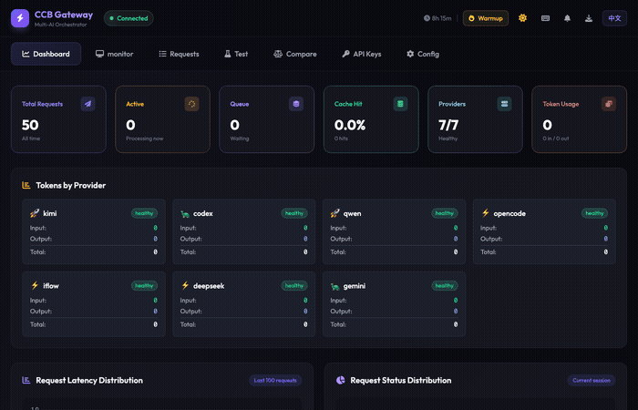

<div align="center">

# 🤖 CCB Gateway

### Enterprise-Grade Multi-AI Orchestration Platform

[](https://github.com/LeoLin990405/ai-router-ccb)
[](LICENSE)
[](https://www.python.org)
[](https://fastapi.tiangolo.com)
[](https://github.com/LeoLin990405/ai-router-ccb/releases)

**Claude orchestrates 9 AI providers through unified Gateway API with dual-system memory and real-time monitoring**

[Features](#-features) • [Quick Start](#-quick-start) • [Documentation](#-documentation) • [Architecture](#-architecture) • [API](#-api-reference)

[🇺🇸 English](README.md) | [🇨🇳 简体中文](README.zh-CN.md)



</div>

---

## 📖 Table of Contents

- [Overview](#-overview)
- [What's New in v0.22](#-whats-new-in-v022)
- [Why CCB Gateway?](#-why-ccb-gateway)
- [Features](#-features)
- [Architecture](#-architecture)
- [Quick Start](#-quick-start)
- [Usage](#-usage)
- [Memory System](#-memory-system-v021)
- [Skills Discovery](#-skills-discovery)
- [Multi-AI Discussion](#-multi-ai-discussion)
- [Web UI](#-web-ui)
- [API Reference](#-api-reference)
- [Documentation](#-documentation)
- [Roadmap](#-roadmap)
- [Contributing](#-contributing)
- [License](#-license)

---

## 🌟 Overview

**CCB Gateway** is a production-ready multi-AI orchestration platform where **Claude acts as the intelligent orchestrator**, routing tasks to 9 specialized AI providers through a unified Gateway API with dual-system memory, caching, retry, and real-time monitoring.

**What makes it unique:**
- 🧠 **Dual-System Memory** - System 1 (instant archiving) + System 2 (nightly consolidation)
- 🎯 **Pre-loaded Context** - 53 Skills + 9 Providers + 4 MCP Servers embedded in every request
- 🔍 **Skills Discovery** - Auto-find and recommend relevant skills via Vercel Skills CLI
- ⚡ **Intelligent Routing** - Speed-tiered fallback with smart provider selection
- 📊 **Real-time Monitoring** - WebSocket-based dashboard with live metrics
- 🔄 **Multi-AI Discussion** - Collaborative problem-solving across multiple AIs
- ☁️ **Cloud Sync** - Google Drive backup with hourly auto-sync
- 🔒 **Security Hardened** - Path traversal protection, race condition fixes

```
                    ┌─────────────────────────────┐
                    │   Claude (Orchestrator)     │
                    │      Claude Code CLI        │
                    └─────────────┬───────────────┘
                                  │
              ┌───────────────────┼───────────────────┐
              │                   │                   │
    ┌─────────▼─────────┐ ┌──────▼──────┐ ┌─────────▼─────────┐
    │   ccb-cli         │ │ Gateway API │ │   Web UI          │
    │  Direct Call      │ │  REST/WS    │ │   Dashboard       │
    └─────────┬─────────┘ └──────┬──────┘ └─────────┬─────────┘
              │                  │                   │
              └──────────────────┼───────────────────┘
                                 │
          ┌──────────┬───────────┼───────────┬───────────┬─────────┐
          ▼          ▼           ▼           ▼           ▼         ▼
     ┌────────┐ ┌────────┐ ┌─────────┐ ┌────────┐ ┌────────┐ ┌────────┐
     │ Kimi   │ │ Qwen   │ │DeepSeek │ │ Codex  │ │Gemini  │ │ iFlow  │
     │ 🚀 7s  │ │ 🚀 12s │ │ ⚡ 16s  │ │ 🐢 48s │ │ 🐢 71s │ │ ⚡ 25s │
     └────────┘ └────────┘ └─────────┘ └────────┘ └────────┘ └────────┘
                           ┌─────────┐ ┌─────────┐ ┌─────────┐
                           │ Qoder   │ │OpenCode │ │ Claude  │
                           │ ⚡ 30s  │ │ ⚡ 42s  │ │ ⚡ 20s  │
                           └─────────┘ └─────────┘ └─────────┘
```

---

## 🆕 What's New in v0.22

### Heuristic Memory Retrieval ⭐

**Stanford Generative Agents-inspired retrieval** with multi-dimensional scoring:

```
final_score = α × Relevance + β × Importance + γ × Recency

Default weights: α=0.4, β=0.3, γ=0.3
Recency decay: exp(-λ × hours_since_access), λ=0.1
```

| Dimension | Source | Description |
|-----------|--------|-------------|
| **Relevance** | FTS5 BM25 | Keyword match quality |
| **Importance** | User/LLM rated | 0.0-1.0 importance score |
| **Recency** | Ebbinghaus curve | Time-decayed access score |

### Enhanced System 2 Operations

| Operation | Description | Trigger |
|-----------|-------------|---------|
| **Decay** | Apply Ebbinghaus forgetting curve | `ccb-consolidate decay` |
| **Merge** | Combine similar memories (>90% similarity) | `ccb-consolidate merge` |
| **Abstract** | LLM-generate summaries from groups | `ccb-consolidate abstract` |
| **Forget** | Remove memories below threshold | `ccb-consolidate forget` |

### New Database Tables

```sql
-- Importance tracking
CREATE TABLE memory_importance (
    memory_id TEXT PRIMARY KEY,
    importance_score REAL DEFAULT 0.5,
    last_accessed_at DATETIME,
    access_count INTEGER DEFAULT 0,
    decay_rate REAL DEFAULT 0.1
);

-- Access logging for recency calculation
CREATE TABLE memory_access_log (
    memory_id TEXT, memory_type TEXT,
    accessed_at DATETIME, access_context TEXT
);

-- System 2 consolidation audit trail
CREATE TABLE consolidation_log (
    consolidation_type TEXT,  -- 'merge' | 'abstract' | 'forget'
    source_ids TEXT, result_id TEXT
);
```

### New CLI Commands

```bash
# Heuristic search with scores
ccb-mem search-scored "query" --limit 10

# Set memory importance
ccb-mem importance <id> 0.8

# Apply time decay
ccb-mem decay --all

# Mark for forgetting
ccb-mem forget <id>

# View v2 statistics
ccb-mem stats-v2

# System 2 consolidation CLI
ccb-consolidate nightly        # Full consolidation pipeline
ccb-consolidate decay          # Apply decay to all memories
ccb-consolidate merge          # Merge similar memories
ccb-consolidate abstract       # Generate abstractions
ccb-consolidate forget         # Clean expired memories
ccb-consolidate stats          # View consolidation stats
```

### Configuration

**`~/.ccb/heuristic_config.json`:**
```json
{
  "retrieval": {
    "relevance_weight": 0.4,
    "importance_weight": 0.3,
    "recency_weight": 0.3,
    "decay_rate": 0.1,
    "candidate_pool_size": 50,
    "final_limit": 5
  },
  "importance": {
    "default_score": 0.5,
    "user_marked_boost": 0.3
  },
  "decay": {
    "lambda": 0.1,
    "min_score": 0.01,
    "max_age_days": 90
  },
  "system2": {
    "merge_similarity_threshold": 0.9,
    "abstract_group_min_size": 5,
    "forget_score_threshold": 0.01,
    "forget_age_days": 90
  }
}
```

---

## 📦 v0.21 Features (Previous)

### Memory Transparency & Write APIs

**Building on v0.20's dual-system architecture** with transparency, write APIs, and LLM integration:

| Feature | Description |
|---------|-------------|
| **Memory Transparency** | Track which memories influenced each request |
| **Observations CRUD** | Manual memory management with categories & confidence |
| **LLM Consolidator** | AI-powered insight extraction during consolidation |
| **Config API** | Runtime configuration for memory injection behavior |
| **Skills Feedback** | Rating system to improve skill recommendations |
| **Discussion Memory** | Persist multi-AI discussions to memory system |

### New API Endpoints

```
# Memory Transparency
GET  /api/memory/request/{id}       # View injected memories for request
GET  /api/memory/injections         # List all injection history

# Observations CRUD
POST   /api/memory/add              # Create observation
GET    /api/memory/observations     # List observations
PUT    /api/memory/{id}             # Update observation
DELETE /api/memory/{id}             # Delete observation

# Configuration
GET  /api/memory/config             # Get current config
POST /api/memory/config             # Update config

# Skills Feedback
POST /api/skills/{name}/feedback    # Submit skill feedback
GET  /api/skills/feedback/all       # List all feedback

# Discussion Memory
GET  /api/discussions               # List discussions
POST /api/discussions/{id}/memory   # Save discussion to memory
```

### Web UI Updates

- **Memory Tab Sub-tabs**: Sessions | Observations | Injections | Discussions
- **Observations Management**: Add, edit, delete with category filters
- **Injection Viewer**: See exactly what memories affected each request
- **Config Panel**: Toggle auto-inject, set limits, choose strategy
- **Skills Feedback**: Rate skill usefulness directly from Skills tab

### CLI Enhancements

```bash
# New ccb-mem commands
ccb-mem trace <request_id>       # View injection details
ccb-mem injections --limit 10    # Recent injection history
ccb-mem stats --detailed         # Expanded statistics
ccb-mem consolidate --dry-run    # Preview LLM consolidation
ccb-mem export --format json     # Export memories
```

### Async & Streaming Mode (避免超时)

```bash
# 异步模式 - 立即返回 request_id，不等待完成
ccb-cli --async kimi "你的问题"

# 流式模式 - 异步提交 + 自动跟踪实时输出
ccb-cli --stream kimi "你的问题"
ccb-cli -s deepseek reasoner "复杂问题"

# 实时查看任务输出
ccb-tail <request_id>            # 查看输出
ccb-tail -f <request_id>         # 持续跟踪 (like tail -f)
ccb-tail --latest -f             # 跟踪最新请求
ccb-tail --list                  # 列出所有流
```

**优势：**
- 🚀 异步模式立即返回，避免 CLI 超时
- 📺 实时查看思考链和输出块
- 💾 所有输出持久化到 `~/.ccb/streams/`
- 🔍 支持增量读取 (适合长任务)

---

## 📦 v0.20 Features (Previous)

### Dual-System Memory Architecture

**Inspired by human cognition** - Fast automatic capture + Deep overnight processing:

| System | Speed | Purpose | Storage |
|--------|-------|---------|---------|
| **System 1** | ⚡ Instant | Auto-archive on `/clear` or `/compact` | `~/.ccb/context_archive/*.md` |
| **System 2** | 🌙 Nightly | Consolidate insights into long-term memory | `~/.ccb/memories/*.md` |

### New Features

- 🧠 **Context Saver** - Automatically saves session context to Markdown
- 📚 **Memory Consolidator** - Nightly processing generates structured long-term memory
- 🔧 **ccb-mem CLI** - New unified memory management tool
- 🔒 **Security Fixes** - Path traversal protection in static file serving
- 🐛 **Race Condition Fix** - Timeout handling in request queue
- 🤖 **Claude Provider** - Added as 9th provider option

### Commands

```bash
# Save current session
ccb-mem save

# Consolidate recent sessions (last 24h)
ccb-mem consolidate --hours 24

# Search memory archives
ccb-mem search "React hooks"

# List recent archives
ccb-mem list

# Inject memory into new conversation
ccb-mem inject 2026-02-05
```

---

## 💡 Why CCB Gateway?

<table>
<tr>
<td width="50%">

### The Problem

❌ Multiple AI CLIs with different interfaces
❌ Manual provider selection is tedious
❌ No memory between conversations
❌ Context lost, AI doesn't know available tools
❌ No visibility into operations
❌ No collaboration between AIs
❌ Wasted time on failed requests

</td>
<td width="50%">

### The Solution

✅ **Unified Gateway API** - One interface for all
✅ **Intelligent Routing** - Auto-select best AI
✅ **Dual-System Memory** - Fast + Deep processing
✅ **Pre-loaded Tools** - 53 Skills embedded
✅ **Real-time Dashboard** - Full visibility
✅ **Multi-AI Discussion** - Collaborative AI
✅ **Retry & Fallback** - Built-in resilience

</td>
</tr>
</table>

---

## ✨ Features

### 🧠 Dual-System Memory (v0.22)

**Human-like memory architecture** - Fast automatic capture combined with deep overnight processing, now with **heuristic retrieval**.

<details>
<summary><b>Heuristic Retrieval (NEW in v0.22)</b></summary>

**Stanford Generative Agents-inspired scoring** combining three dimensions:

```
final_score = α × Relevance + β × Importance + γ × Recency
```

- **Relevance (α=0.4)**: FTS5 BM25 keyword matching score
- **Importance (β=0.3)**: User-rated or LLM-evaluated importance (0.0-1.0)
- **Recency (γ=0.3)**: Ebbinghaus forgetting curve: `exp(-0.1 × hours_since_access)`

**Example retrieval:**
```bash
# Search with heuristic scoring
ccb-mem search-scored "authentication" --limit 5

# Output shows all dimensions:
# ID: 123 | Score: 0.82 | R: 0.95 | I: 0.80 | T: 0.65
# ID: 456 | Score: 0.71 | R: 0.80 | I: 0.70 | T: 0.60
```

</details>

<details>
<summary><b>System 1: Context Saver (Click to expand)</b></summary>

**Instant automatic archiving** when you run `/clear` or `/compact`:

```
Session Start → Work → /clear triggered
                           │
                           ▼
              ┌────────────────────────┐
              │   Context Saver        │
              │   (System 1 - Fast)    │
              ├────────────────────────┤
              │ • Parse session.jsonl  │
              │ • Extract key messages │
              │ • Summarize tool calls │
              │ • Track file changes   │
              │ • Save as Markdown     │
              └────────────────────────┘
                           │
                           ▼
              ~/.ccb/context_archive/
              session_abc123_2026-02-05.md
```

**Archive Format:**
```markdown
# Session: abc123
- **Project**: /Users/leo/project
- **Duration**: 45 minutes
- **Model**: claude-opus-4-5

## Task Summary
Implemented user authentication with JWT...

## Key Messages
- User: "Add login functionality"
- Assistant: Created auth module with...

## Tool Calls
| Tool | Count |
|------|-------|
| Edit | 15 |
| Read | 8 |
| Bash | 5 |

## File Changes
- `src/auth.ts` - Created
- `src/middleware.ts` - Modified
```

</details>

<details>
<summary><b>System 2: Memory Consolidator (Click to expand)</b></summary>

**Nightly deep processing** - Runs automatically or on-demand:

```
Nightly (3 AM) or Manual Trigger
              │
              ▼
┌──────────────────────────────────────┐
│      Memory Consolidator             │
│      (System 2 - Deep)               │
├──────────────────────────────────────┤
│ 1. Collect recent archives           │
│ 2. Cluster by project/topic          │
│ 3. Extract patterns & learnings      │
│ 4. Generate structured memory        │
│ 5. Save to long-term storage         │
└──────────────────────────────────────┘
              │
              ▼
        ~/.ccb/memories/
        2026-02-05_consolidated.md
```

**Consolidated Memory Format:**
```markdown
# Memory: 2026-02-05

## Projects Worked On
### /Users/leo/ccb-gateway
- Sessions: 3
- Duration: 2h 15m
- Focus: Memory system implementation

### /Users/leo/web-app
- Sessions: 2
- Duration: 1h 30m
- Focus: React component refactoring

## Key Learnings
1. SQLite FTS5 requires content sync triggers
2. Race conditions in async timeout handling
3. Path traversal protection patterns

## Frequently Used Tools
| Tool | Count | Projects |
|------|-------|----------|
| Edit | 45 | 2 |
| Read | 32 | 2 |
| Bash | 18 | 1 |

## Technical Decisions
- Chose Markdown over JSON for human readability
- Dual-system architecture for memory efficiency
```

</details>

<details>
<summary><b>Memory Injection</b></summary>

**Auto-inject relevant memories** into new conversations:

```bash
# Start new session with yesterday's memory
claude --context $(ccb-mem inject 2026-02-04)

# Or manually via @
@~/.ccb/memories/2026-02-04_consolidated.md
```

The Gateway middleware can also auto-inject:
```json
{
  "memory": {
    "enabled": true,
    "auto_inject_recent": true,
    "inject_days": 3
  }
}
```

</details>

**Usage:**
```bash
# Automatic - hook triggers on /clear
# Session automatically saved to ~/.ccb/context_archive/

# Manual save
ccb-mem save

# Consolidate last 24 hours
ccb-mem consolidate --hours 24

# Search across all memories
ccb-mem search "authentication"

# List recent archives
ccb-mem list
```

---

### ⚡ Intelligent Routing & Fallback

**Speed-tiered provider chains** with automatic fallback on failure:

```yaml
Fast Tier (3-15s):    Kimi → Qwen → DeepSeek
Medium Tier (15-45s): iFlow → Qoder → OpenCode → Claude
Slow Tier (45-90s):   Codex → Gemini
```

**Features:**
- 🎯 Smart provider recommendation based on task keywords
- 🔄 Automatic retry with exponential backoff
- 📉 Fallback chains for resilience
- ⚖️ Load balancing across providers

---

### 🔍 Skills Discovery

**Auto-discover and recommend relevant Claude Code Skills** - Integrates with [Vercel Skills](https://github.com/vercel-labs/skills).

```
User Request → Extract Keywords → Search Skills (Local + Remote)
                                         ↓
                        ┌────────────────┴────────────────┐
                        │                                  │
                   scan-skills.sh              npx skills find [query]
                   (Local Skills)               (Vercel Registry)
                        │                                  │
                        └────────────────┬────────────────┘
                                         ↓
                         Inject Recommendations to Context
```

**Usage:**
```bash
# Gateway auto-discovers skills
ccb-cli kimi "help me create a PDF"
# [MemoryMiddleware] 💡 Found 1 relevant Skill: /pdf

# Manual search
ccb-skills recommend "create spreadsheet"
ccb-skills stats
```

---

### 🤝 Multi-AI Discussion

**Collaborative problem-solving** - Multiple AIs discuss and reach consensus:

```bash
ccb-submit discuss \
  --providers kimi,codex,gemini \
  --rounds 3 \
  --strategy "consensus" \
  "Design a scalable microservices architecture"
```

**Aggregation Strategies:**
- **consensus** - All AIs must agree
- **majority** - Most common answer wins
- **first_success** - First valid response
- **best_quality** - Highest quality (scored)

---

### 📊 Real-time Monitoring

**WebSocket-based dashboard** with live updates at http://localhost:8765/web

<table>
<tr>
<td width="33%">

**Metrics**
- Request count
- Success rate
- Avg latency
- Provider status

</td>
<td width="33%">

**Queue**
- Pending requests
- Processing
- Completed
- Failed

</td>
<td width="33%">

**Logs**
- Real-time events
- Error tracking
- Performance data
- WebSocket feed

</td>
</tr>
</table>

---

### 🚀 Production Features

<table>
<tr>
<td width="50%">

**Performance**
- ⚡ Response caching (configurable TTL)
- 🔄 Request retry with backoff
- 📊 Rate limiting per provider
- 🎯 Parallel execution

</td>
<td width="50%">

**Reliability**
- 🛡️ Automatic fallback chains
- 💾 Persistent request queue
- 📝 Comprehensive logging
- 🔍 Request tracking (ID-based)

</td>
</tr>
<tr>
<td width="50%">

**Security**
- 🔐 API key authentication
- 🚦 Rate limiting
- 🔒 Path traversal protection
- 📋 Audit logging

</td>
<td width="50%">

**Observability**
- 📊 Prometheus metrics
- 📈 Real-time dashboards
- 🔔 WebSocket events
- 📋 Detailed request logs

</td>
</tr>
</table>

---

## 🏗️ Architecture

### System Overview

```
┌─────────────────────────────────────────────────────────────────┐
│                      CCB Gateway (v0.22)                         │
├─────────────────────────────────────────────────────────────────┤
│                                                                   │
│  ┌────────────────────────────────────────────────────────┐    │
│  │            Dual-System Memory (v0.22)                   │    │
│  ├────────────────────────────────────────────────────────┤    │
│  │                                                          │    │
│  │  System 1 (Fast):           System 2 (Deep):            │    │
│  │  • ContextSaver             • MemoryConsolidator        │    │
│  │  • Auto on /clear           • Nightly processing        │    │
│  │  • Markdown archives        • Long-term memory          │    │
│  │                                                          │    │
│  └────────────────────────────────────────────────────────┘    │
│                          │                                       │
│  ┌────────────────────────▼─────────────────────────────┐      │
│  │            Gateway Server Core                        │      │
│  ├───────────────────────────────────────────────────────┤      │
│  │  • Request Queue (async)                              │      │
│  │  • Retry Executor                                     │      │
│  │  • Cache Manager                                      │      │
│  │  • Rate Limiter                                       │      │
│  │  • Metrics Collector                                  │      │
│  └───────────────────────────────────────────────────────┘      │
│                          │                                       │
│  ┌───────────┬───────────┼───────────┬───────────┐            │
│  ▼           ▼           ▼           ▼           ▼            │
│ ┌─────┐   ┌─────┐   ┌─────────┐  ┌─────┐   ┌───────┐        │
│ │Kimi │   │Qwen │   │DeepSeek │  │Codex│   │Claude │   ...  │
│ └─────┘   └─────┘   └─────────┘  └─────┘   └───────┘        │
│                                                                 │
└─────────────────────────────────────────────────────────────────┘
```

### Memory System Flow

```
Session Activity
    │
    ├─→ [System 1: Context Saver]
    │   ├─→ Triggered by /clear or /compact
    │   ├─→ Parse session.jsonl
    │   ├─→ Extract key messages & tool calls
    │   └─→ Save to ~/.ccb/context_archive/
    │
    └─→ [System 2: Memory Consolidator]
        ├─→ Runs nightly (3 AM) or manually
        ├─→ Collect recent archives
        ├─→ Cluster by project/topic
        ├─→ Extract patterns & learnings
        └─→ Save to ~/.ccb/memories/
```

---

## 🚀 Quick Start

### Prerequisites

- Python 3.9+
- Node.js 16+ (for MCP servers)
- Git

### Installation

```bash
# 1. Clone repository
git clone https://github.com/LeoLin990405/ai-router-ccb.git
cd ai-router-ccb

# 2. Install Python dependencies
pip install -r requirements.txt

# 3. Install Node.js dependencies (for MCP)
npm install

# 4. Configure AI providers
# Edit config files in ~/.claude/ or use environment variables
```

### Start Gateway Server

```bash
# Start with default config
python3 -m lib.gateway.gateway_server --port 8765

# Output:
# [SystemContext] Preloading system information...
# [SystemContext] Loaded 53 skills
# [SystemContext] Loaded 9 providers
# [SystemContext] Loaded 4 MCP servers
# [MemoryMiddleware] Initialized (enabled=True)
# ✓ Server running at http://localhost:8765
```

### First Request

```bash
# Using ccb-cli (automatic memory!)
ccb-cli kimi "Explain React hooks"

# Using curl
curl -X POST http://localhost:8765/api/ask \
  -H "Content-Type: application/json" \
  -d '{
    "provider": "kimi",
    "message": "Explain React hooks",
    "wait": true,
    "timeout": 60
  }'
```

---

## 📚 Usage

### ccb-cli - Direct CLI

**Fastest way to call any AI provider:**

```bash
# Basic usage
ccb-cli <provider> [model] "<message>"

# Examples
ccb-cli kimi "How do I optimize SQL queries?"
ccb-cli codex o3 "Prove the halting problem is undecidable"
ccb-cli gemini 3f "Design a responsive navbar"
ccb-cli claude "Review this code"

# With agent role
ccb-cli codex o3 -a reviewer "Review this PR"
ccb-cli kimi -a sisyphus "Fix this bug: ..."
```

**Model shortcuts:**
| Provider | Shortcuts | Example |
|----------|-----------|---------|
| codex | o3, o4-mini, gpt-4o, o1-pro | `ccb-cli codex o3 "..."` |
| gemini | 3f, 3p, 2.5f, 2.5p | `ccb-cli gemini 3f "..."` |
| kimi | thinking, normal | `ccb-cli kimi thinking "..."` |
| deepseek | reasoner, chat | `ccb-cli deepseek reasoner "..."` |
| claude | - | `ccb-cli claude "..."` |

### ccb-mem - Memory Management

```bash
# Save current session
ccb-mem save

# Save specific session
ccb-mem save /path/to/session.jsonl

# Consolidate recent sessions
ccb-mem consolidate --hours 24

# Search memories
ccb-mem search "authentication"

# List recent archives
ccb-mem list

# Get injection path for date
ccb-mem inject 2026-02-05
```

---

## 🧠 Memory System (v0.22)

### Dual-System Architecture

The memory system is inspired by human cognition:

| System | Analogy | Trigger | Output |
|--------|---------|---------|--------|
| **System 1** | Short-term memory | `/clear`, `/compact` | Markdown archive |
| **System 2** | Long-term memory | Nightly cron | Consolidated memory |

### Heuristic Retrieval (NEW)

v0.22 introduces **Stanford Generative Agents-inspired retrieval**:

```
final_score = α × Relevance + β × Importance + γ × Recency
```

| Parameter | Default | Description |
|-----------|---------|-------------|
| α (relevance) | 0.4 | FTS5 BM25 score weight |
| β (importance) | 0.3 | User/LLM importance weight |
| γ (recency) | 0.3 | Time decay weight |
| λ (decay rate) | 0.1 | Ebbinghaus curve parameter |

### File Locations

```
~/.ccb/
├── context_archive/          # System 1 output
│   ├── session_abc_2026-02-05.md
│   ├── session_def_2026-02-05.md
│   └── ...
├── memories/                  # System 2 output
│   ├── 2026-02-04_consolidated.md
│   ├── 2026-02-05_consolidated.md
│   └── ...
└── ccb_memory.db             # SQLite for Gateway middleware
```

### Configuration

**`~/.ccb/gateway_config.json`:**
```json
{
  "memory": {
    "enabled": true,
    "auto_inject": true,
    "auto_record": true,
    "inject_system_context": true,
    "max_injected_memories": 5
  },
  "dual_system": {
    "system1_enabled": true,
    "system2_enabled": true,
    "consolidate_hour": 3,
    "retention_days": 30
  }
}
```

---

## 🖥️ Web UI

**Real-time monitoring dashboard at http://localhost:8765/web**

### Features

- 📊 **Live Metrics** - Request count, success rate, latency
- 🧠 **Memory Management** - Session-based conversation history with full-text search
- 🛠️ **Skills Discovery** - Find and recommend relevant skills for your tasks
- 📋 **Request Queue** - Pending, processing, completed
- 🔴 **Live Logs** - Real-time event stream via WebSocket
- 🤖 **Provider Status** - Health checks for all 9 providers
- 📈 **Charts** - Performance trends and analytics

### Screenshots

<details>
<summary><b>Dashboard Overview</b></summary>


Real-time metrics, provider status, and system health monitoring.

</details>

<details>
<summary><b>Memory Tab - Session Management</b></summary>


Session-based conversation history with FTS5 full-text search.

</details>

<details>
<summary><b>Skills Tab - Discovery & Recommendations</b></summary>


Smart skills discovery powered by Vercel Skills CLI.

</details>

---

## 📖 API Reference

### Core Endpoints

| Method | Endpoint | Description |
|--------|----------|-------------|
| GET | `/health` | Health check |
| GET | `/providers` | List all 9 providers |
| POST | `/api/ask` | Synchronous request |
| POST | `/api/submit` | Asynchronous request |
| GET | `/api/query/{id}` | Query request status |
| GET | `/api/pending` | List pending requests |
| POST | `/api/cancel/{id}` | Cancel request |
| WS | `/ws` | WebSocket connection |

### Memory Endpoints (v0.21)

| Method | Endpoint | Description |
|--------|----------|-------------|
| GET | `/api/memory/sessions` | List memory sessions |
| GET | `/api/memory/search` | Full-text search |
| GET | `/api/memory/stats` | Memory statistics |
| POST | `/api/memory/add` | Create observation |
| GET | `/api/memory/observations` | List observations |
| PUT | `/api/memory/{id}` | Update observation |
| DELETE | `/api/memory/{id}` | Delete observation |
| GET | `/api/memory/request/{id}` | View injection for request |
| GET | `/api/memory/injections` | List injection history |
| GET | `/api/memory/config` | Get memory config |
| POST | `/api/memory/config` | Update memory config |

### Skills Endpoints (v0.21)

| Method | Endpoint | Description |
|--------|----------|-------------|
| GET | `/api/skills/recommendations` | Get skill recommendations |
| GET | `/api/skills/list` | List all skills |
| POST | `/api/skills/{name}/feedback` | Submit skill feedback |
| GET | `/api/skills/feedback/all` | List all feedback |

### Discussion Endpoints (v0.21)

| Method | Endpoint | Description |
|--------|----------|-------------|
| GET | `/api/discussions` | List all discussions |
| GET | `/api/discussions/{id}` | Get discussion details |
| POST | `/api/discussions/{id}/memory` | Save discussion to memory |

### Request Parameters

**POST /api/ask & /api/submit:**
```json
{
  "provider": "kimi",           // Required: AI provider (9 options)
  "message": "Your question",   // Required: User message
  "model": "thinking",          // Optional: Specific model
  "wait": true,                 // Optional: Wait for completion
  "timeout": 120,               // Optional: Timeout in seconds
  "metadata": {}                // Optional: Custom metadata
}
```

---

## 📚 Documentation

### Core Documentation

- **[Memory System Architecture](lib/memory/INTEGRATION_DESIGN.md)** - Full design
- **[Database Structure](lib/memory/DATABASE_STRUCTURE.md)** - Schema and queries
- **[Cloud Sync Guide](lib/memory/SYNC_QUICKSTART.md)** - Google Drive setup
- **[V1 vs V2 Comparison](lib/memory/V1_VS_V2.md)** - Memory evolution

### Additional Resources

- **[API Documentation](docs/API.md)** - Complete API reference
- **[Configuration Guide](docs/CONFIG.md)** - All configuration options
- **[Deployment Guide](docs/DEPLOYMENT.md)** - Production deployment

---

## 🗺️ Roadmap

### v0.22 (Current) - Heuristic Memory ✅

- [x] **Heuristic Retrieval** - Stanford Generative Agents-inspired αR + βI + γT scoring
- [x] **Importance Tracking** - User-rated and LLM-evaluated importance scores
- [x] **Access Logging** - Track memory access for recency calculation
- [x] **Ebbinghaus Decay** - Time-based forgetting curve implementation
- [x] **System 2 Enhancement** - Merge, abstract, forget operations
- [x] **ccb-consolidate CLI** - New consolidation management tool
- [x] **Configurable Weights** - `~/.ccb/heuristic_config.json`

### v0.21 (Previous) - Memory Enhancement ✅

- [x] **Memory Transparency** - Track injected memories per request
- [x] **Observations CRUD** - Manual memory management API
- [x] **LLM Consolidator** - AI-powered insight extraction
- [x] **Memory Config API** - Runtime configuration
- [x] **Skills Feedback Loop** - Rating-based recommendations
- [x] **Discussion Memory** - Persist multi-AI discussions
- [x] **CLI Enhancements** - trace, injections, export commands

### v0.20 (Previous) - Dual-System Memory ✅

- [x] **Context Saver** - System 1 instant archiving
- [x] **Memory Consolidator** - System 2 nightly processing
- [x] **ccb-mem CLI** - Unified memory management
- [x] **Security Hardening** - Path traversal protection
- [x] **Claude Provider** - Added as 9th provider

### v0.23 (Q2 2026) - Semantic Enhancement

- [ ] Qdrant vector database integration
- [ ] Semantic similarity search
- [ ] Multi-language embeddings
- [ ] Memory clustering

### v0.24 (Q3 2026) - Agent Autonomy

- [ ] Agent memory function calls (Letta mode)
- [ ] Structured memory blocks (core_memory)
- [ ] Self-updating agents
- [ ] Memory version control

### v0.25 (Q4 2026) - Team Collaboration

- [ ] Multi-user memory isolation
- [ ] Shared memory pools
- [ ] Permission system
- [ ] Real-time collaboration

---

## 🤝 Contributing

We welcome contributions! Please see [CONTRIBUTING.md](CONTRIBUTING.md) for details.

### Quick Start for Contributors

```bash
# 1. Fork and clone
git clone https://github.com/YOUR_USERNAME/ai-router-ccb.git
cd ai-router-ccb

# 2. Create branch
git checkout -b feature/your-feature

# 3. Make changes and test
python3 -m pytest tests/

# 4. Commit and push
git commit -m "feat: add your feature"
git push origin feature/your-feature

# 5. Create Pull Request
```

---

## 📜 License

This project is licensed under the MIT License - see the [LICENSE](LICENSE) file for details.

---

## 🙏 Acknowledgments

**Inspired by:**
- [Stanford Generative Agents](https://arxiv.org/pdf/2304.03442) - Heuristic retrieval formula
- [Awesome-AI-Memory](https://github.com/IAAR-Shanghai/Awesome-AI-Memory) - Memory system survey
- [Mem0](https://github.com/mem0ai/mem0) - Semantic memory architecture
- [Letta (MemGPT)](https://github.com/cpacker/MemGPT) - Structured memory blocks
- [LangChain](https://github.com/langchain-ai/langchain) - Memory patterns
- [claude-mem](https://github.com/thedotmack/claude-mem) - Lifecycle hooks

**Built with:**
- [FastAPI](https://fastapi.tiangolo.com) - Modern web framework
- [SQLite](https://www.sqlite.org) - Reliable database
- [Claude Code](https://www.anthropic.com/claude) - AI orchestrator

---

## 📞 Support

- 🐛 Issues: [GitHub Issues](https://github.com/LeoLin990405/ai-router-ccb/issues)
- 📖 Docs: [Documentation](docs/)

---

<div align="center">

**Made with ❤️ by the CCB Team**

**[⬆ Back to Top](#-ccb-gateway)**

</div>
