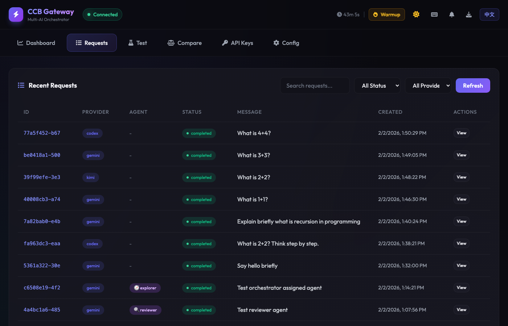
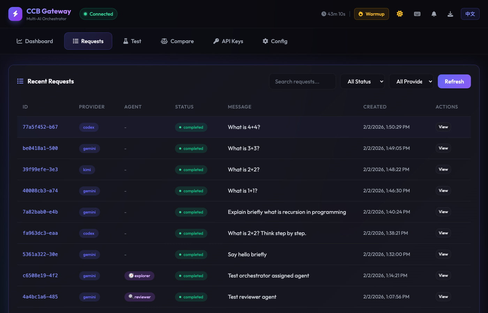
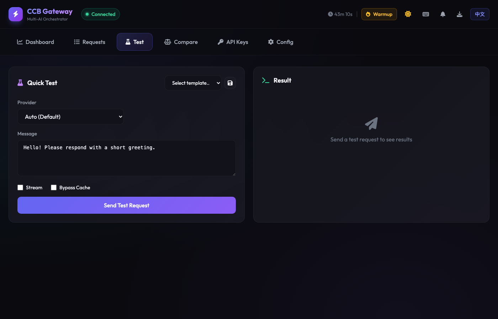
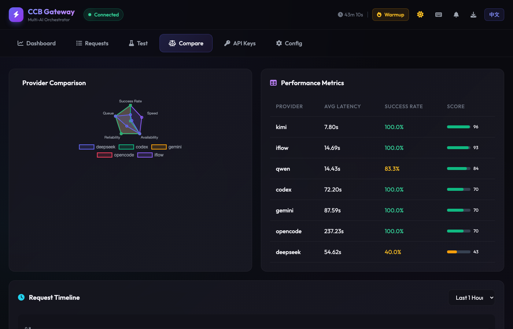
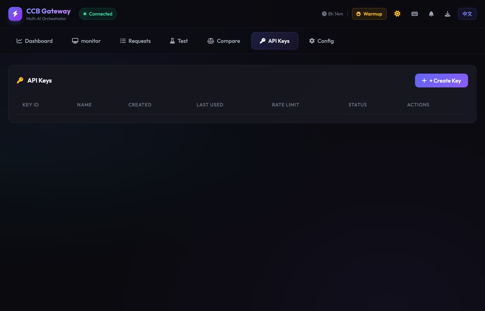
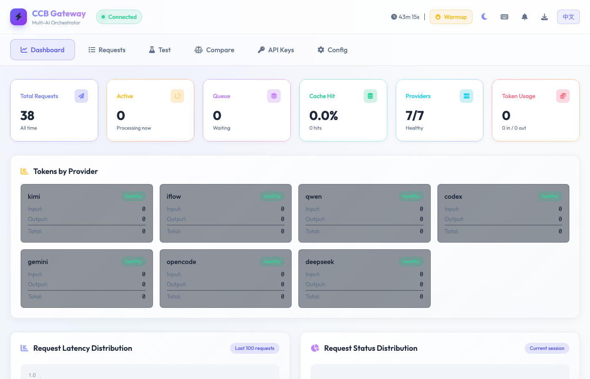

<p align="center">
  
  
  
  
</p>

<h1 align="center">
  <br>
  🤖
  <br>
  CCB Gateway
  <br>
</h1>

<h4 align="center">Enterprise-Grade Multi-AI Orchestration Platform</h4>

<p align="center">
  <em>Claude as orchestrator, unified Gateway API managing 7 AI providers with real-time monitoring</em>
</p>

<p align="center">
  <a href="#-features">Features</a> •
  <a href="#-quick-start">Quick Start</a> •
  <a href="#-web-ui">Web UI</a> •
  <a href="#-api-reference">API</a> •
  <a href="#-architecture">Architecture</a> •
  <a href="#-installation">Installation</a>
</p>

<p align="center">
  <strong>English</strong> | <a href="README.zh-CN.md">简体中文</a>
</p>

<p align="center">
  
</p>

---

## Overview

**CCB Gateway** is a production-ready multi-AI orchestration platform where **Claude serves as the orchestrator**, intelligently dispatching tasks to 7 AI providers through a unified Gateway API.

```
                    ┌─────────────────────────────┐
                    │   Claude (Orchestrator)     │
                    │      Claude Code CLI        │
                    └─────────────┬───────────────┘
                                  │
                    ┌─────────────▼───────────────┐
                    │      CCB Gateway API        │
                    │    http://localhost:8765    │
                    └─────────────┬───────────────┘
                                  │
          ┌───────────┬───────────┼───────────┬───────────┐
          ▼           ▼           ▼           ▼           ▼
     ┌─────────┐ ┌─────────┐ ┌─────────┐ ┌─────────┐ ┌─────────┐
     │ Gemini  │ │ DeepSeek│ │  Codex  │ │  Kimi   │ │  Qwen   │
     └─────────┘ └─────────┘ └─────────┘ └─────────┘ └─────────┘
                      ┌─────────┐ ┌─────────┐
                      │OpenCode │ │  iFlow  │
                      └─────────┘ └─────────┘
```

### Why CCB Gateway?

| Challenge | Solution |
|-----------|----------|
| Multiple AI CLIs with different interfaces | **Unified Gateway API** for all providers |
| Manual provider selection | **Intelligent routing** based on task analysis |
| No visibility into AI operations | **Real-time monitoring** with WebSocket + Web UI |
| No caching or retry logic | **Built-in caching, retry, and fallback** |
| Can't see AI thinking process | **Thinking chain & raw output capture** |

---

## ✨ Features

### Core Gateway

- **REST API** - `POST /api/ask`, `GET /api/reply/{id}`, `GET /api/status`
- **WebSocket** - Real-time events at `/api/ws`
- **Priority Queue** - SQLite-backed request prioritization
- **Multi-Backend** - HTTP API, CLI Exec, WezTerm integration
- **Health Monitoring** - Automatic provider health checks

### Production Features

- **API Authentication** - API key-based auth with SHA-256 hashing
- **Rate Limiting** - Token bucket algorithm, per-key limits
- **Response Caching** - SQLite cache with TTL and pattern exclusion
- **Retry & Fallback** - Exponential backoff, automatic provider fallback
- **Parallel Queries** - Query multiple providers simultaneously
- **Prometheus Metrics** - `/metrics` endpoint for monitoring
- **Streaming** - Server-Sent Events for real-time responses

### CLI Monitoring (New)

- **Thinking Chain Capture** - Extract reasoning from `<thinking>` tags, `[Thinking]` blocks
- **Raw Output Storage** - Full CLI output preserved for debugging
- **JSONL Parsing** - Codex/OpenCode structured output extraction
- **Web UI Display** - Collapsible thinking chain and raw output in request details

---

## 🚀 Quick Start

### Start Gateway

```bash
# Start the gateway server
cd ~/.local/share/codex-dual
python3 -m lib.gateway.gateway_server --port 8765

# Or with config file
python3 -m lib.gateway.gateway_server --config ~/.ccb/gateway.yaml
```

### Send Requests

```bash
# Submit request
curl -X POST http://localhost:8765/api/ask \
  -H "Content-Type: application/json" \
  -d '{"provider": "qwen", "message": "Hello"}'

# Get response (with wait)
curl "http://localhost:8765/api/reply/{request_id}?wait=true"

# Parallel query to all providers
curl -X POST http://localhost:8765/api/ask \
  -H "Content-Type: application/json" \
  -d '{"provider": "@all", "message": "What is 2+2?", "aggregation_strategy": "first_success"}'
```

### Check Status

```bash
# Gateway status
curl http://localhost:8765/api/status

# Prometheus metrics
curl http://localhost:8765/metrics
```

---

## 🖥️ Web UI

Access the Web UI at `http://localhost:8765/` after starting the gateway.

<p align="center">
  
  <br>
  <em>Dashboard - Real-time gateway stats and provider status</em>
</p>

### Dashboard
- Real-time gateway stats and provider status
- Request timeline visualization
- Activity logs with WebSocket updates

### Request Management
- Pagination with configurable page size
- Search and filter by provider, status, content
- Retry failed requests with one click
- **View thinking chain and raw output** for each request

<p align="center">
  
  <br>
  <em>Request Management - View and manage all requests</em>
</p>

<p align="center">
  
  <br>
  <em>Request Detail - Thinking chain and raw output</em>
</p>

### Test Console
- Interactive API testing
- Provider selection with auto-routing option
- Streaming support toggle

<p align="center">
  
  <br>
  <em>Test Console - Interactive API testing</em>
</p>

### Compare Mode
- Side-by-side provider comparison
- Query multiple providers simultaneously

<p align="center">
  
  <br>
  <em>Compare Mode - Side-by-side provider comparison</em>
</p>

### Features
- **Dark/Light Theme** - Toggle with localStorage persistence
- **i18n Support** - English and Chinese localization
- **Keyboard Shortcuts** - `1-6` tabs, `R` refresh, `T` test, `?` help
- **Confirmation Dialogs** - Prevent accidental deletions
- **Copy to Clipboard** - One-click copy for API keys

<p align="center">
  
  <br>
  <em>API Keys Management</em>
</p>

<p align="center">
  
  <br>
  <em>Light Theme Support</em>
</p>

---

## 📡 API Reference

### Endpoints

| Method | Endpoint | Description |
|--------|----------|-------------|
| `POST` | `/api/ask` | Submit a request to a provider |
| `GET` | `/api/reply/{id}` | Get response (`?wait=true` supported) |
| `GET` | `/api/status` | Gateway and provider status |
| `GET` | `/api/requests` | List recent requests with pagination |
| `DELETE` | `/api/request/{id}` | Cancel a pending request |
| `GET` | `/api/health` | Health check |
| `GET` | `/api/cache/stats` | Cache statistics |
| `DELETE` | `/api/cache` | Clear cache |
| `GET` | `/metrics` | Prometheus metrics |
| `GET` | `/docs` | Interactive API documentation |

### Request Body

```json
{
  "provider": "qwen",
  "message": "Your question here",
  "timeout_s": 300,
  "priority": 50,
  "cache_bypass": false,
  "aggregation_strategy": null
}
```

### Response (with thinking/raw_output)

```json
{
  "request_id": "abc123-def",
  "status": "completed",
  "response": "The answer is...",
  "thinking": "<extracted thinking chain if available>",
  "raw_output": "<full CLI output for debugging>",
  "latency_ms": 1234.56,
  "cached": false
}
```

### API Authentication

```bash
# Create API key
curl -X POST http://localhost:8765/api/admin/keys \
  -H "Content-Type: application/json" \
  -d '{"name": "my-app", "rate_limit_rpm": 100}'

# Use API key
curl -X POST http://localhost:8765/api/ask \
  -H "X-API-Key: your-api-key" \
  -H "Content-Type: application/json" \
  -d '{"provider": "qwen", "message": "Hello"}'
```

---

## 🏗️ Architecture

```
┌─────────────────────────────────────────────────────────────────────┐
│                      CCB Gateway Architecture                        │
├─────────────────────────────────────────────────────────────────────┤
│                                                                      │
│  ┌────────────────────────────────────────────────────────────────┐ │
│  │                 Claude (Orchestrator / 主脑)                   │ │
│  │            Intelligent task dispatch and coordination          │ │
│  └────────────────────────────────────────────────────────────────┘ │
│                                  │                                   │
│  ┌────────────────────────────────────────────────────────────────┐ │
│  │                      Gateway API Layer                         │ │
│  │  ┌─────────┐ ┌─────────┐ ┌─────────┐ ┌─────────┐ ┌─────────┐  │ │
│  │  │REST API │ │WebSocket│ │  Auth   │ │  Rate   │ │ Metrics │  │ │
│  │  │(FastAPI)│ │(Events) │ │(API Key)│ │ Limit   │ │(Prometh)│  │ │
│  │  └─────────┘ └─────────┘ └─────────┘ └─────────┘ └─────────┘  │ │
│  └────────────────────────────────────────────────────────────────┘ │
│                                  │                                   │
│  ┌────────────────────────────────────────────────────────────────┐ │
│  │                     Processing Layer                           │ │
│  │  ┌─────────┐ ┌─────────┐ ┌─────────┐ ┌─────────┐ ┌─────────┐  │ │
│  │  │  Cache  │ │  Retry  │ │Parallel │ │Streaming│ │Thinking │  │ │
│  │  │(SQLite) │ │(Fallback│ │(Multi-AI│ │  (SSE)  │ │ Extract │  │ │
│  │  └─────────┘ └─────────┘ └─────────┘ └─────────┘ └─────────┘  │ │
│  └────────────────────────────────────────────────────────────────┘ │
│                                  │                                   │
│  ┌────────────────────────────────────────────────────────────────┐ │
│  │                  Provider Layer (7 Providers)                  │ │
│  │  ┌───────┐ ┌────────┐ ┌───────┐ ┌────────┐ ┌──────┐ ┌──────┐  │ │
│  │  │Gemini │ │DeepSeek│ │ Codex │ │OpenCode│ │ Kimi │ │ Qwen │  │ │
│  │  └───────┘ └────────┘ └───────┘ └────────┘ └──────┘ └──────┘  │ │
│  │  ┌───────┐                                                     │ │
│  │  │ iFlow │                                                     │ │
│  │  └───────┘                                                     │ │
│  └────────────────────────────────────────────────────────────────┘ │
│                                                                      │
└─────────────────────────────────────────────────────────────────────┘
```

### Provider Matrix

| Provider | Backend | Best For | Avg Latency |
|----------|---------|----------|-------------|
| **Kimi** | CLI Exec | Chinese, long context | ~8s |
| **Qwen** | CLI Exec | Multilingual | ~14s |
| **iFlow** | CLI Exec | Workflow automation | ~15s |
| **Codex** | CLI Exec | Code generation | ~19s |
| **DeepSeek** | CLI Exec | Deep reasoning | ~55s |
| **Gemini** | CLI Exec | Frontend, review | ~100s |
| **OpenCode** | CLI Exec | General coding | ~237s |

> **Note**: Claude is the orchestrator and does not participate in task dispatch.

---

## 📦 Installation

### Prerequisites

- **Python 3.9+**
- **WezTerm** (recommended) or tmux
- Provider CLIs installed: `codex`, `gemini`, `opencode`, `deepseek`, `kimi`, `qwen`, `iflow`

### Install

```bash
# Clone repository
git clone https://github.com/LeoLin990405/ai-router-ccb.git ~/.local/share/codex-dual

# Install dependencies
pip install fastapi uvicorn pyyaml aiohttp prometheus-client

# Start gateway
cd ~/.local/share/codex-dual
python3 -m lib.gateway.gateway_server --port 8765

# Open Web UI
open http://localhost:8765/
```

### Configuration

```yaml
# ~/.ccb/gateway.yaml
server:
  host: "127.0.0.1"
  port: 8765

default_provider: "qwen"

providers:
  gemini:
    enabled: true
    backend_type: "cli_exec"
    cli_command: "gemini"
    timeout_s: 300
  codex:
    enabled: true
    backend_type: "cli_exec"
    cli_command: "codex"
  # ... other providers
```

---

## 🔄 Recent Updates

### v0.8.x - CLI Monitoring
- **Thinking Chain Capture** - Extract and display AI reasoning process
- **Raw Output Storage** - Full CLI output preserved in database
- **Improved Output Cleaning** - Better JSON extraction for Gemini format
- **Web UI Enhancements** - Collapsible thinking/raw output display

### v0.7.x - Production Features
- API Authentication with rate limiting
- Response caching with TTL
- Retry and fallback mechanisms
- Prometheus metrics integration

---

## 🙏 Acknowledgements

- **[bfly123/claude_code_bridge](https://github.com/bfly123/claude_code_bridge)** - Original multi-AI collaboration framework
- **[Grafbase/Nexus](https://github.com/grafbase/nexus)** - AI gateway architecture inspiration

---

## 👥 Contributors

- **Leo** ([@LeoLin990405](https://github.com/LeoLin990405)) - Project Lead
- **Claude** (Anthropic Claude Opus 4.5) - Architecture & Implementation

---

## 📄 License

MIT License - See [LICENSE](LICENSE)

---

<p align="center">
  <sub>Built with collaboration between human and AI</sub>
  <br>
  <sub>⭐ Star this repo if you find it useful!</sub>
</p>
